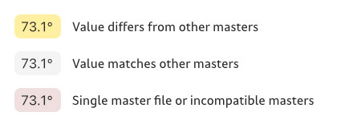

# Show Kinks

Previously known as *Show Smooth Node Angle and Proportion*.

This is a plugin for the [Glyphs font editor](https://glyphsapp.com/).  

One of the most common problems when designing multiple master and variable fonts is kinks. This reporter plugin will highlight the nodes that **may** produce kinks in yellow. When you select one of them, it will tell you the angle between the handles and their proportions. If any one of the values matches all the other masters (becoming light gray), a kink will not happen.

The labels will have different colors depending on what’s happening on the other masters:

## The theory

Kinks happen when:

- three points form a line with a smooth connection (green node in the middle point);
- the three points have different angles in other masters;
- the three points have different proportions in other masters. 

If all of the above is true, you will get kinks in interpolations. If any one of the above is not true, kinks will not happen. [This is best explained in this tutorial.](https://glyphsapp.com/learn/multiple-masters-part-2-keeping-your-outlines-compatible#g-avoid-kinks) Keeping all that in mind, the easiest way to avoid kinks is by making sure either the angle or the proportions of the three points are kept the same across all masters, which is exactly what this plugin checks for.

**IMPORTANT: This plugin does not read instances or measure kinks in instances.** It is meant as a faster way of detecting possible kinks based on the geometry of nodes across masters. If you need to find actual kinks on masters or instances, I recommend **mekkablue’s Kink Finder** script, part of [his Glyphs Scripts repository](https://github.com/mekkablue/Glyphs-Scripts). 

Also note I baked a small tolerance of 1° for the angles and 1% for the proportions into the code, as it is very difficult to exactly match angles and handle lengths on a grid. If you believe these values do not produce a satisfactory result, please open an issue.

## Additional options

### Show angles of other masters

The plugin can show the other masters’ angles on the background, which can make the process of adjusting the angles easier. This option can be activated via context menu (Ctrl- or right-click).

### Show ratio value

You also have the option to display the proportion between handles as a single ratio value. This option is accessible via context menu (Ctrl- or right-click):

## Installation

1. Download the complete ZIP file and unpack it, or clone the repository.
2. Double click the .glyphsReporter file. Confirm the dialog that appears in Glyphs.
3. Restart Glyphs

## Planned features

- Add drawing aids to make the adjustment process easier (maybe showing the other master’s corresponding nodes in the background).

## License

Copyright 2019 [Henrique Beier](https://www.harbortype.com) @harbortype

Made possible with the [GlyphsSDK](https://github.com/schriftgestalt/GlyphsSDK) by Georg Seifert (@schriftgestalt), Jan Gerner (@yanone) and Rainer Erich Scheichelbauer (@mekkablue). 

Code samples from [Stem Thickness](https://github.com/RafalBuchner/StemThickness) by Rafał Buchner (@RafalBuchner) and [Show Crosshair](https://github.com/mekkablue/ShowCrosshair) by Rainer Erich Scheichelbauer (@mekkablue).

Licensed under the Apache License, Version 2.0 (the "License"); you may not use this file except in compliance with the License. You may obtain a copy of the License at

http://www.apache.org/licenses/LICENSE-2.0

See the License file included in this repository for further details.
